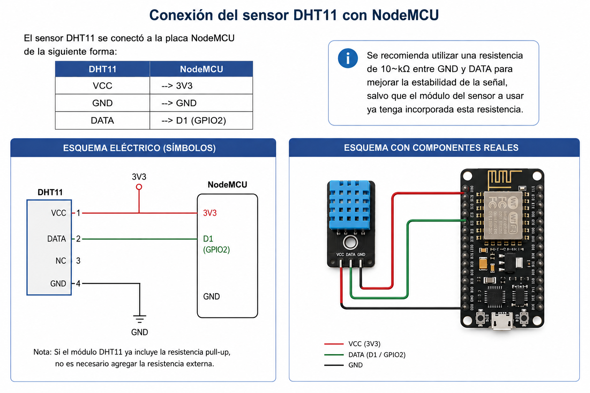

# E.3. Esquema de conexión del sensor DHT11

El sensor DHT11 se conectó a la placa NodeMCU de la siguiente forma:

| **[Pin DHT11](ca://s?q=Pin_DHT11)** | **[Pin NodeMCU](ca://s?q=Pin_NodeMCU)** |
|------------------------------------|------------------------------------------|
| VCC                                | 3V3                                      |
| GND                                | GND                                      |
| DATA                               | D4 (GPIO2)                               |

Se recomienda utilizar una resistencia de 10 kΩ entre VCC y DATA para mejorar la estabilidad de la señal, salvo que el módulo del sensor utilizado ya incorpore esta resistencia.

*Imagen generada con ayuda de IA.*
