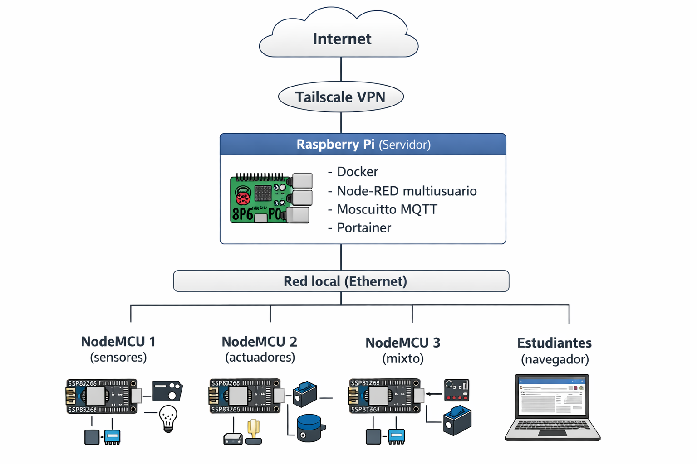

# F.6. Diagrama conceptual de la arquitectura de red

El siguiente diagrama resume la arquitectura híbrida utilizada, integrando:

- **[conectividad local mediante Ethernet](ca://s?q=Conectividad_Ethernet_IoT)**,
- **[acceso inalámbrico mediante Wi‑Fi](ca://s?q=Conectividad_WiFi_IoT)**,
- **[acceso remoto seguro a través de Tailscale](ca://s?q=Acceso_remoto_Tailscale)**,
- **[servicios desplegados en la Raspberry Pi](ca://s?q=Servicios_RaspberryPi_IoT)**.

*Figura: Esquema conceptual de la arquitectura de red (elaboración propia con asistencia de IA).*
