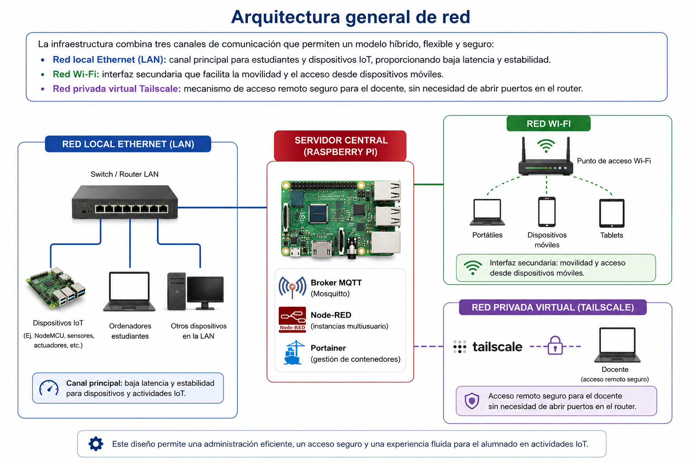

# F.7. — Habilitación de acceso a Internet en la red aislada TFM‑IoT‑AP

Este anexo documenta la configuración realizada en la Raspberry Pi para permitir que los equipos del alumnado, conectados al punto de acceso *TFM‑IoT‑AP*, puedan acceder simultáneamente a los servicios locales (Node‑RED, Mosquitto, Portainer) y a Internet. Esta funcionalidad facilita el trabajo en las prácticas, ya que permite consultar documentación técnica, buscar ejemplos o descargar recursos externos sin abandonar la red aislada del aula.

## Activación del reenvío IP (IP forwarding)

Se cre el archivo **/etc/sysctl.d/99-ipforward.conf** con el siguiente contenido:

```bash
net.ipv4.ip_forward=1
```

Se realiza la aplicación de la configuración:

```bash
sudo sysctl --system
```

Y se verrifica:
```bash
cat /proc/sys/net/ipv4/ip_forward
```
## Configuración de NAT (enmascaramiento)

Estas son las reglas aplicadas:
```bash
sudo iptables -t nat -A POSTROUTING -o eth0 -j MASQUERADE
sudo iptables -A FORWARD -i wlan0 -o eth0 -j ACCEPT
sudo iptables -A FORWARD -i eth0 -o wlan0 -m state --state RELATED,ESTABLISHED -j ACCEPT
```

Se realiza un guardado persistente:
```bash
sudo sh -c "iptables-save > /etc/iptables.ipv4.nat"
```

Y se crear la orden de carga automática al arrancar, editando el archivo **/etc/rc.local**, con el siguiente contenido:

```bash
#!/bin/sh -e
iptables-restore < /etc/iptables.ipv4.nat
exit 0
```

## Configuración de dnsmasq (DHCP + gateway + DNS)

Se edita el siguiente archivo **/etc/dnsmasq.conf**, al que se añaden las siguientes líneas:

```bash
dhcp-option=3,192.168.4.1
dhcp-option=6,192.168.4.1
```

Para, a continuación, realizar el reinicio del servicio:

```bash
sudo systemctl restart dnsmasq
```

## Pruebas de funcionamiento

Se realiza las pruebas del funcionamiento desde el dispositivo del alumno con estos datos de conexión:

- IP recibida: 192.168.4.x
- Gateway: 192.168.4.1
- DNS: 192.168.4.1

Mediante el aplicación terminal:

```bash
ping 8.8.8.8
```



*Figura: Esquema conceptual de la arquitectura de red para la habilitación del internet a través de el punto de acceso TFM-IoT-AP (elaboración propia con asistencia de IA).*
